theme: Letters from Sweden, 7
footer: @mattstratton

# Shifting Left Securely

---
# whoami


@mattstratton

---


^ Stability is something that we attempt to ensure by reducing the vectors that can make changes to a system.

---
[.hide-footer]
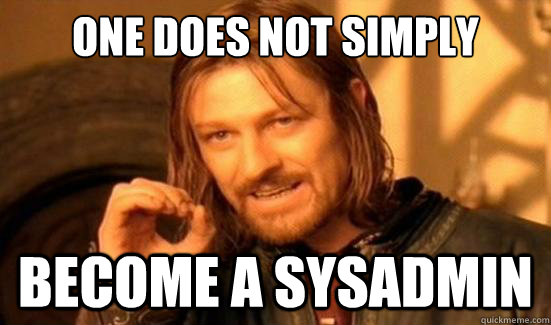

^ In practice, that means "deployments are executed by trusted individuals with admin access".


---

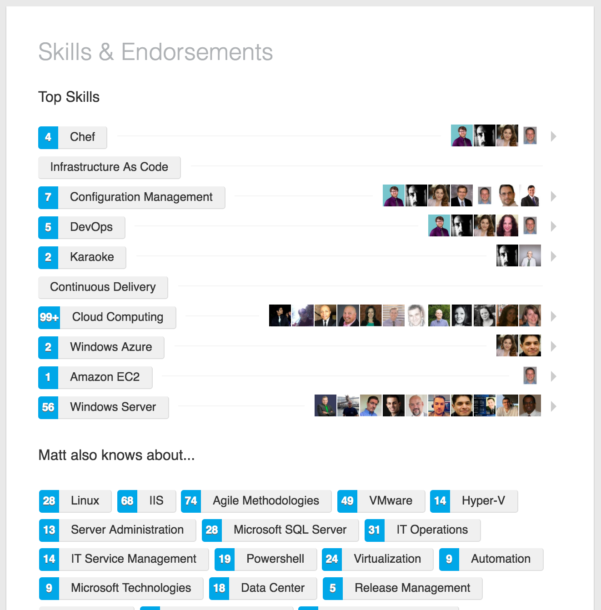

^ Just to be clear, my background is in system administration. This is not a "bag on the sysadmin" talk.

---


^ The problem with the "separation of duties" approach to solve all your stablity issues is that everyone can make mistakes. A job title doesn't imply infallibilty. Every sysadmin who thinks that they're title means won't make a mistake will tell me a story over a couple of pints about when they totally fucked up production.

---


^ It's also a huge burden on one group to be able to understand all the options and variance that steps in a "run book" will result in.

---

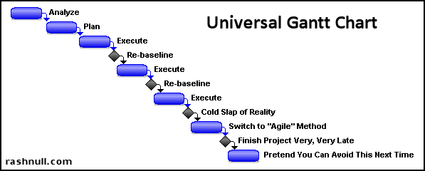

^ How do we usually do this? We might have a project that is 8 sprints long. And we don't think about security until the 8th sprint which is the "hardening" sprint.

---
[.hide-footer]


^ Natureally, we fail all of this hardening, because we haven't been thinking about security all this time.

---

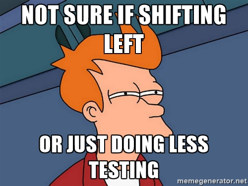

^ What is "shifting left" anyway? The idea is that we move our testing further "to the left" in our pipeline. The closer to the introduction of the defect that it is discovered, the cheaper and easier it is to fix.

---


^ Of course, this introduces some challenges, right? I mean, if my tests don't pass, I can change the tests. Then the light is green and the trap is clean.

---
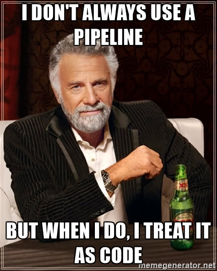

^ We talk about treating your Infrastructure as code, etc. Your workflow should be treated as code too! Make sure your pipeline configuration is stored in version control, tested, and abstracted.


---


## How does this help me with security?

---

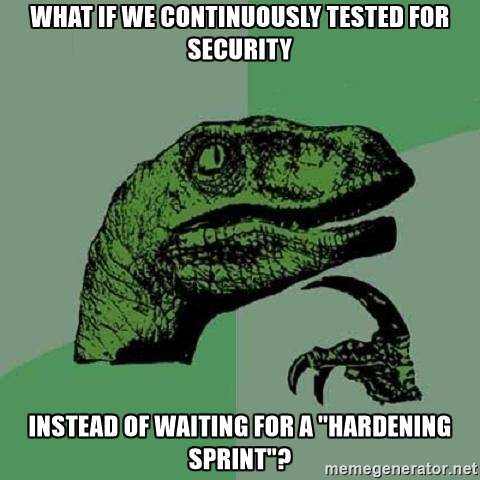

^ Compliance and security are just another aspect of quality

---
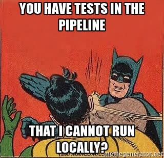

^ What you do NOT want to do is have a test in the pipeline that cannot be run by the local developer. Basically, if you do this, you're a jerkface.

---


---

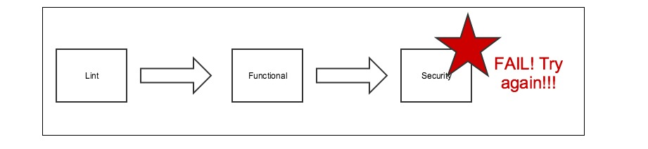


^ The problem is that often times, these tests we do at the end are heavy. We need something better.

---
[.build-lists: true]
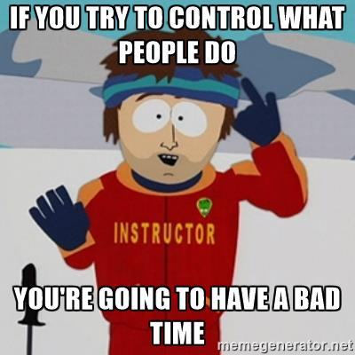

* If you spend time keeping people from doing x, y, or z
* They will instead do a, b, or c to get the outcome they want

---

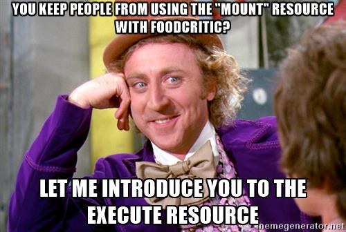

^ No matter how much you try to block the "how", you should focus on the "what"

---
[.build-lists: true]
# Problem with distributed configuration management

* Developer reads on Stack Overflow that disabling `selinux` will make his Node app work better.
* Developer updates his cookbook to disable `selinux`
* Sysadmins get fired because of 3viL haxx0rz

---
[.build-lists: true]
# The better way

* Developer reads on Stack Overflow that disabling `selinux` will make his Node app work better.
* Developer updates his cookbook to disable `selinux`
* Developer runs local tests which include compliance checks
* Compliance checks test for state of `selinux`
* Tests fail. Developer says "Welp, I guess I can't do that."

---
[.hide-footer]


# What if the developers don't run those local tests?

The pipeline catches them.

They'll do better next time.

^ Take a page from the folks at Etsy. They have a high-trust culture, but that doesn't mean you don't test. I don't even trust myself to remember to test all the time. Remember, we enable local testing, but we don't count on it.

---

### If you truly care about a thing, you care enough to write a test

---
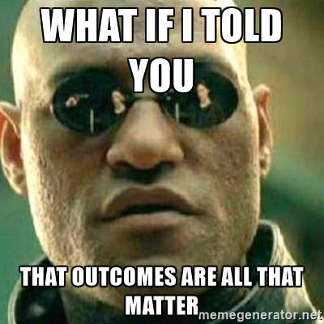

^ We are testing for outcomes. Outcomes are what matter. Our pipeline is creating an artifact (in the case of infracode, this artifact is a converged node). What matters is the state of that outcome. How you got it there is not the question. We should be testing compliance and security against artifacts, and the outcome we are testing is "is this thing the way it should be or is it a scary nightmare that should never see production"?

---
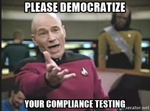

^ Remember when I talked about the hubris of sysadmins? Infosec folks do it too. Tools are kind of the least important thing to think about, but make sure it's not a tool that can only run tests from the security folks. If you care about compliance, move that stuff to the left. If your tool can't do that, it's time to fine another tool.

^ That doesn't mean you need to throw out what you have, but consider adding something. But the more that you can emulate whatever you care about testing in production into your pipeline, the happier you will be. Monitoring is just testing with a time dimension; this applies to compliance as well.

---

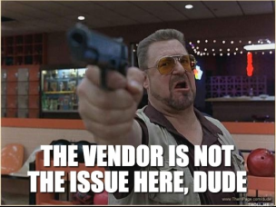

^ Oh boy, here comes the vendor pitch...

---
```
> grep "^Protocol" /etc/ssh/sshd_config | sed 's/Protocol //'
 2
 ```
 *vs*

```
control 'ssh-1234' do
  impact 1.0
  title 'Server: Set protocol version to SSHv2'
  desc "
    Set the SSH protocol version to 2. Don't use legacy
    insecure SSHv1 connections anymore...
  "

  describe sshd_config do
   its('Protocol') { should eq 2 }
  end
end
```

^ I'm not here to pitch products. Take from this what makes sense in your world, but let's think about this approach and why it matters.

---
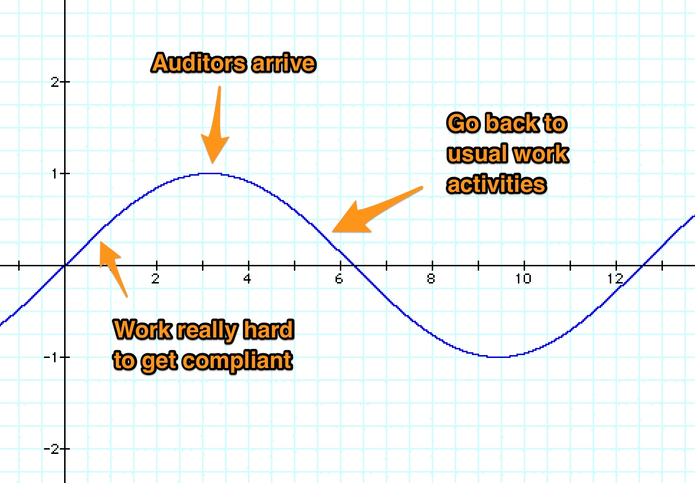

^ The benefit of this is that we are in a state of continuous compliance. We don't have audit theatre.

---
## To Review
- Treat your pipeline as code
- Trust (but verify) your domain experts
- Focus on the what, not the how. Outcomes, outcomes, outcomes.
- Use your production audit tests in your pipeline
- Did I mention test?

---

# Questions?
---

##resources
- Sidney Dekker - *Field Guide to Human Error*
- github.com/mattstratton/speaking
- twitter.com/mattstratton
- speakerdeck.com/mattstratton
- arresteddevops.com
